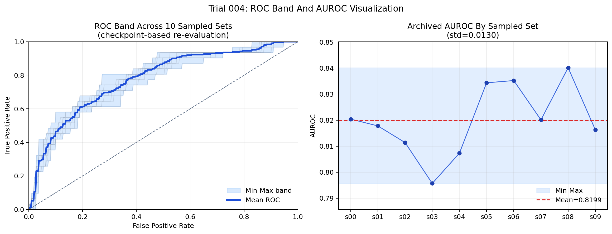

# AF Ablation RFCA SSL i0001 MTAE TH5

## Executive Summary

이번 결과의 핵심은 RFCA 코호트에서 ECG 기반 `LVR05_high` 분류가 exploratory 수준에서 충분히 의미 있는 분리 성능을 보였다는 점입니다. archived run 기준 best trial은 평균 `test_macro_auroc = 0.8199 +/- 0.0130`을 기록했고, best single set은 `AUROC 0.8402`, `AUPRC 0.5602`였습니다.

동시에 이 결과는 바로 final claim으로 쓰기 어렵습니다. 이유는 hparam search의 objective가 `test_macro_auroc`였기 때문입니다. 즉 test 결과가 model selection에 직접 사용됐고, archived run도 `trial_limit=25` 중 `19`개 trial만 남아 있어 이번 수치는 "promising preliminary result"로 정리하는 것이 맞습니다.

## 한눈에 보기

```text
Study Flow

RFCA zarr ECG
    |
    v
TH5 manifest build
    |
    v
PID-grouped sampled sets x10
    |
    v
Grid search over finetune hyperparameters
    |
    v
Finetune + immediate test evaluation per set
    |
    v
Rank trials by mean test_macro_auroc
```

## 1. Study Question

이번 실험은 RFCA 코호트의 12-lead ECG representation만으로 structural burden surrogate인 `LVR05_high`를 어느 정도 구분할 수 있는지 확인하는 pilot입니다. 모델은 random init이 아니라 self-supervised pretraining을 거친 ViT encoder를 downstream binary classification에 finetune하는 구조입니다.

질문을 더 좁히면 아래 두 가지입니다.

1. ECG만으로 `LVR05_high`에 대한 분리 신호가 실제로 존재하는가
2. MTAE-pretrained encoder가 RFCA downstream task에서 usable representation을 제공하는가

## 2. Cohort Snapshot

이번 archived run에서 사용된 각 sampled set 크기는 동일했습니다.

| split | rows | notes |
| --- | ---: | --- |
| train | 1677 | repeated ECG per PID 포함 |
| valid | 142 | PID당 1 ECG |
| test | 142 | PID당 1 ECG |

RFCA manifest 통계 기준 전체 코호트는 아래와 같습니다.

| metric | value |
| --- | ---: |
| overall ECGs | 1961 |
| overall PIDs | 713 |
| test positive rate | 0.155 |
| test positive count | 22 |
| test negative count | 120 |

```text
Rows Per Split
train  1677 | ########################################
valid   142 | ###
test    142 | ###
```

해석 시 중요한 점은 train split에는 반복 ECG가 있고 valid/test는 PID당 1개라는 점입니다. 따라서 train과 evaluation의 샘플 구조는 완전히 같지 않습니다.

## 3. Experimental Design

### Model / Input

- Backbone: ViT (`embed_dim=768`, `depth=12`, `heads=12`)
- Input: 12-lead ECG, `signal_length=2250`, target sample rate `250 Hz`, 9초 crop
- Preprocessing: standardization + random crop + waveform augmentation
- SSL init: archived run 기준 MTAE checkpoint 사용
- Finetune epochs: 10

### Archived Search Space

이번 결과는 현재 `study-af-ablation/configs/`의 최신 YAML이 아니라 archived `run_config.yaml`을 기준으로 해석해야 합니다. archived run의 탐색 공간은 아래와 같았습니다.

| hyperparameter | values |
| --- | --- |
| `finetune.lr` | `0.03, 0.01, 0.001, 0.0003, 0.0001` |
| `finetune.weight_decay` | `0.01, 0.05` |
| `finetune.layer_decay` | `0.5, 0.8, 0.9, 1.0` |
| `data.batch_size` | `16, 32, 64, 128` |
| `finetune.num_freeze_layers` | `0, 6, 9` |

전체 조합 수는 `5 x 2 x 4 x 4 x 3 = 480`개지만, 실제 archived run은 이 중 shuffle된 `25`개만 시도하도록 설정되어 있었고, 현재 결과 디렉토리에는 `19`개 trial만 기록되어 있습니다.

### Selection Rule

가장 중요한 caveat입니다.

```text
Selection rule used in this run:
objective_metric = test_macro_auroc
best_trial = argmax(mean test AUROC across sampled sets)
```

즉 이번 run은 validation-driven model selection이 아니라 test-driven exploratory search입니다.

## 4. Main Results

### 4.1 Best Trial

best trial은 `trial_004`였습니다.

| metric | value |
| --- | ---: |
| mean test AUROC | 0.8199 |
| std across sets | 0.0130 |
| successful sets | 10 / 10 |
| best single-set AUROC | 0.8402 |
| best single-set AUPRC | 0.5602 |
| best single-set test loss | 0.4881 |

best trial의 하이퍼파라미터는 아래와 같습니다.

| hyperparameter | best value |
| --- | ---: |
| `finetune.lr` | 0.001 |
| `finetune.weight_decay` | 0.01 |
| `finetune.layer_decay` | 0.8 |
| `data.batch_size` | 128 |
| `finetune.num_freeze_layers` | 0 |

### 4.2 Top Trials

| rank | trial | mean AUROC | std | lr | wd | layer_decay | batch | freeze |
| --- | ---: | ---: | ---: | ---: | ---: | ---: | ---: | ---: |
| 1 | 4 | 0.8199 | 0.0130 | 0.001 | 0.01 | 0.8 | 128 | 0 |
| 2 | 14 | 0.8133 | 0.0169 | 0.0001 | 0.05 | 0.9 | 32 | 0 |
| 3 | 11 | 0.8099 | 0.0151 | 0.03 | 0.05 | 0.9 | 64 | 9 |
| 4 | 16 | 0.7947 | 0.0220 | 0.0003 | 0.01 | 0.9 | 128 | 0 |
| 5 | 12 | 0.7939 | 0.0130 | 0.0003 | 0.01 | 0.8 | 128 | 6 |

```text
Top-5 Trial Mean AUROC

trial_004  0.8199 | ########################################
trial_014  0.8133 | ######################################
trial_011  0.8099 | #####################################
trial_016  0.7947 | #################################
trial_012  0.7939 | #################################
```

관찰 포인트는 아래와 같습니다.

- 상위권 trial에서 `batch_size=128`이 반복적으로 나타납니다.
- best trial은 `num_freeze_layers=0`으로 encoder를 전부 열고 학습했습니다.
- `layer_decay=0.8~0.9` 영역이 강했고, `layer_decay=1.0`이 반드시 최선은 아니었습니다.
- top-1과 top-2의 차이는 약 `0.0066 AUROC`로 존재하지만 압도적이지는 않습니다.

### 4.3 Best Trial Stability Across Sample Sets

`trial_004`의 set별 AUROC는 아래와 같았습니다.

| set | AUROC |
| --- | ---: |
| 0 | 0.8204 |
| 1 | 0.8178 |
| 2 | 0.8114 |
| 3 | 0.7957 |
| 4 | 0.8073 |
| 5 | 0.8344 |
| 6 | 0.8352 |
| 7 | 0.8201 |
| 8 | 0.8402 |
| 9 | 0.8163 |

```text
Best Trial Per-Set AUROC

set_00  0.8204 | ####################################
set_01  0.8178 | ###################################
set_02  0.8114 | ##################################
set_03  0.7957 | ################################
set_04  0.8073 | #################################
set_05  0.8344 | ######################################
set_06  0.8352 | ######################################
set_07  0.8201 | ####################################
set_08  0.8402 | ########################################
set_09  0.8163 | ###################################
```

최저값이 `0.7957`, 최고값이 `0.8402`였고 표준편차가 `0.0130`이었습니다. 즉 set을 바꿔도 성능이 완전히 무너지지는 않았고, 최소한 "한두 split에만 우연히 맞은 결과"로 보이진 않습니다.

### 4.4 ROC Visualization



왼쪽 패널은 surviving checkpoint artifact로부터 CPU eval output을 다시 생성해 10개 sampled set의 ROC를 FPR grid 기준 min-max band로 감싼 것입니다. 오른쪽 패널은 archived `trial_004/set_scores.csv`의 AUROC 값을 그대로 사용해, 본문에 적은 mean/min/max AUROC와 정확히 맞추었습니다.

주의할 점은, 왼쪽 ROC band는 checkpoint-based re-evaluation이고 오른쪽 AUROC 점들은 archived trainer.test 결과라는 점입니다. 현재 남아 있는 checkpoint artifact만으로는 당시 `test_metrics.yaml`와 완전히 동일한 ROC를 재구성할 수 없어, 보고서에서는 두 정보를 분리해 표시했습니다.

## 5. Interpretation

이번 결과에서 가장 긍정적인 신호는 RFCA task에서 ECG-only representation이 실제 분리 정보를 어느 정도 담고 있다는 점입니다. test positive rate가 약 15.5%인 불균형 상황에서 mean AUROC가 약 0.82라는 것은, pilot 결과로는 충분히 주목할 만합니다.

또한 best trial이 `no freezing + moderate layer decay + nonzero weight decay + large batch` 조합에서 나왔다는 점은, downstream task를 위해 encoder를 꽤 적극적으로 적응시키는 방향이 유리했을 가능성을 시사합니다.

반면 이 결과를 그대로 headline number로 쓰는 것은 위험합니다. model selection이 test 기반이기 때문에, 현재 수치는 성능 추정이라기보다 search outcome에 가깝습니다. 따라서 이 값은 "upper-bound flavored preliminary estimate"로 보는 게 적절합니다.

## 6. Risks And Caveats

### 반드시 보고서에 같이 적어야 할 caveat

- best trial selection이 `test_macro_auroc` 기준입니다.
- archived run config는 `trial_limit=25`였지만 현재 디렉토리에는 `19`개 trial만 남아 있습니다.
- recovery note에 따르면 `trial_018` 일부 artifact는 손상 후 복구되었습니다.
- 현재 study-local config는 이번 archived run과 다르므로, 지금 YAML을 그대로 실행하면 같은 결과가 재현되지 않습니다.

```text
What this result is good for:
- pilot signal 확인
- representation usefulness 점검
- 다음 실험 우선순위 결정

What this result is NOT good for:
- 최종 성능 주장
- 본문 headline metric 확정
- 독립 hold-out 성능 추정
```

## 7. Reporting Language You Can Safely Use

아래 정도 문장은 현재 단계에서 비교적 방어 가능합니다.

> In the RFCA cohort, an MTAE-pretrained ECG encoder achieved a mean test macro-AUROC of approximately 0.82 for `LVR05_high` classification across repeated PID-level sampled sets. Because model selection in this run used `test_macro_auroc` as the search objective, the result should be treated as exploratory and preliminary rather than a final unbiased estimate.

한글 버전으로는 아래처럼 적을 수 있습니다.

> RFCA 코호트에서 MTAE-pretrained ECG encoder를 이용한 `LVR05_high` 분류는 PID 단위 반복 sampled set 기준 평균 test macro-AUROC 약 0.82를 보였다. 다만 본 결과는 test metric 기반 exploratory hyperparameter search에서 도출된 값이므로, 최종 성능 추정이 아니라 preliminary signal로 해석해야 한다.

## 8. Recommended Next Steps

1. objective를 `valid_macro_auroc`로 바꾼 validation-driven search를 다시 수행
2. archived `run_config.yaml` 기준으로 동일 조건 재현본을 별도 디렉토리에 다시 생성
3. best setting 확정 후 independent test는 한 번만 수행
4. AUROC뿐 아니라 AUPRC, calibration, operating-point sensitivity/specificity를 함께 정리
5. non-SSL 또는 다른 pretraining checkpoint 대비 delta를 같은 split에서 비교

## Appendix: Source Files

- archived run config: `/data/projects/ai-ecg/outputs/af_ablation_202602/af_ablation_202602_hparam_search_lvr05_high_rfca_ssl_i0001_mtae_th5_hparam_search_20260316_001959/run_config.yaml`
- hparam summary: `/data/projects/ai-ecg/outputs/af_ablation_202602/af_ablation_202602_hparam_search_lvr05_high_rfca_ssl_i0001_mtae_th5_hparam_search_20260316_001959/hparam_search_summary.csv`
- best trial: `/data/projects/ai-ecg/outputs/af_ablation_202602/af_ablation_202602_hparam_search_lvr05_high_rfca_ssl_i0001_mtae_th5_hparam_search_20260316_001959/best_trial.yaml`
- best-trial set scores: `/data/projects/ai-ecg/outputs/af_ablation_202602/af_ablation_202602_hparam_search_lvr05_high_rfca_ssl_i0001_mtae_th5_hparam_search_20260316_001959/trial_004/set_scores.csv`
- recovery note: `/data/projects/ai-ecg/outputs/af_ablation_202602/af_ablation_202602_hparam_search_lvr05_high_rfca_ssl_i0001_mtae_th5_hparam_search_20260316_001959/RECOVERY_NOTES_20260317.txt`
- cohort stats: `/data/projects/study-af-ablation/data/rfca_zarr_manifest_stats.md`
