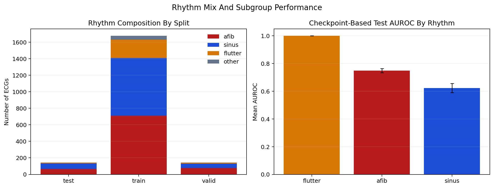

# Rhythm Composition Analysis

## 핵심 결론

현재 RFCA TH5 manifest는 AFib-only dataset도 아니고 sinus-only dataset도 아닙니다. procedure 시점 이전 ECG를 시간창 기준으로 고른 mixed-rhythm cohort이며, train/valid/test 모두 AFib, sinus, atrial flutter가 함께 포함되어 있습니다.

또 하나 중요한 점은 `LVR05_high` 양성률이 rhythm subgroup에 따라 다르다는 것입니다. 특히 AFib subgroup의 양성률이 sinus subgroup보다 일관되게 높아, rhythm state 자체가 target과 상관될 가능성이 있습니다. 따라서 모델 성능 해석 시 "structural burden signal" 외에 rhythm/state signal이 섞여 있을 가능성을 함께 봐야 합니다.

## 데이터가 어떻게 선택됐는가

manifest 생성 스크립트는 `/data/projects/study-af-ablation/scripts/build_finetune_manifest_rfca_zarr.py`입니다.

- rhythm 필터링은 하지 않습니다.
- train은 procedure 전 180일 이내 ECG를 PID별로 확장합니다.
- valid/test는 procedure 전 90일 anchor ECG를 기반으로 PID당 1개 ECG를 선택합니다.
- 즉 선택 기준은 rhythm이 아니라 time window + PID split입니다.

## Rhythm Mix By Split

| split | rhythm | n | positive | negative | positive rate |
| --- | --- | ---: | ---: | ---: | ---: |
| train | afib | 709 | 298 | 411 | 0.420 |
| train | sinus | 699 | 197 | 502 | 0.282 |
| train | flutter | 222 | 77 | 145 | 0.347 |
| train | other | 47 | 24 | 23 | 0.511 |
| valid | afib | 76 | 26 | 50 | 0.342 |
| valid | sinus | 53 | 10 | 43 | 0.189 |
| valid | flutter | 12 | 4 | 8 | 0.333 |
| valid | other | 1 | 1 | 0 | 1.000 |
| test | afib | 64 | 22 | 42 | 0.344 |
| test | sinus | 69 | 7 | 62 | 0.101 |
| test | flutter | 7 | 2 | 5 | 0.286 |
| test | other | 2 | 0 | 2 | 0.000 |

## 해석 포인트

1. train split은 AFib 42.3%, sinus 41.7%, flutter 13.2%로 거의 반반에 가까운 mixed-rhythm입니다.
2. valid split은 AFib 비중이 53.5%로 가장 높고, sinus는 37.3%입니다.
3. test split도 AFib 45.1%, sinus 48.6%, flutter 4.9%로 mixed-rhythm입니다.
4. `LVR05_high` 양성률은 test 기준 AFib 34.4%, sinus 10.1%, flutter 28.6%로 차이가 큽니다.
5. 즉 현재 task는 rhythm-neutral structural burden prediction이라기보다, rhythm state와 구조적 burden이 함께 얽힌 setting일 가능성이 큽니다.

## Best Trial Subgroup Performance

아래 subgroup 성능은 best trial의 surviving checkpoint artifact로부터 다시 생성한 test output 기준입니다. 따라서 archived `trainer.test` 수치와 완전히 같은 값은 아니고, exploratory subgroup view로 해석해야 합니다.

| subgroup | n | pos | neg | mean AUROC | std | mean AUPRC |
| --- | ---: | ---: | ---: | ---: | ---: | ---: |
| afib | 64 | 22 | 42 | 0.749 | 0.015 | 0.546 |
| sinus | 69 | 7 | 62 | 0.623 | 0.033 | 0.290 |
| flutter | 7 | 2 | 5 | 1.000 | 0.000 | 1.000 |

## 추가 insight

- AFib subgroup의 checkpoint-based mean AUROC가 sinus subgroup보다 높았습니다.
- 하지만 AFib subgroup은 positive prevalence 자체가 더 높기 때문에, 이 차이를 "모델이 AFib에서 더 잘 일반화한다"고 단정하면 안 됩니다.
- 오히려 현재 설정에서는 모델이 rhythm/state 차이를 일부 proxy로 사용할 가능성이 있다는 해석이 더 보수적입니다.
- flutter subgroup은 샘플 수가 7개뿐이라 수치 해석 가치가 거의 없습니다.

## 추천 해석 문장

> The current RFCA TH5 dataset is a mixed-rhythm cohort rather than a sinus-only or AFib-only cohort. Because `LVR05_high` prevalence differs substantially across rhythm subgroups, part of the observed predictive signal may reflect rhythm/state information in addition to structural burden.
